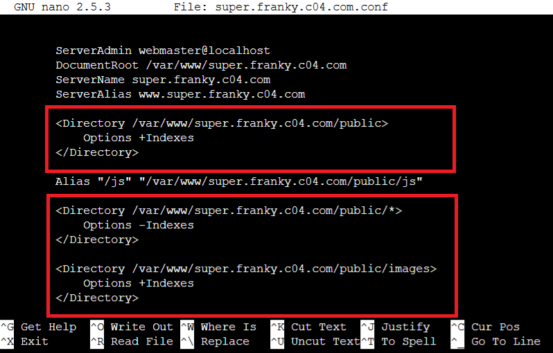

# Praktikum Modul 2 Jaringan Komputer

Kelompok : C4

Anggota Kelompok :

- Muhammad Arif Faizin (05111940000060)
- Aufi Fillah (05111940000148)
- Abiya Sabitta Ragadani (05111940000166)

## Soal
Luffy adalah seorang yang akan jadi Raja Bajak Laut. Demi membuat Luffy menjadi Raja Bajak Laut, Nami ingin membuat sebuah peta, bantu Nami untuk membuat peta berikut:


EniesLobby akan dijadikan sebagai DNS Master, Water7 akan dijadikan DNS Slave, dan Skypie akan digunakan sebagai Web Server. Terdapat 2 Client yaitu Loguetown, dan Alabasta. Semua node terhubung pada router Foosha, sehingga dapat mengakses internet (1). 

Luffy ingin menghubungi Franky yang berada di EniesLobby dengan denden mushi. Kalian diminta Luffy untuk membuat website utama dengan mengakses franky.yyy.com dengan alias www.franky.yyy.com pada folder kaizoku (2). Setelah itu buat subdomain super.franky.yyy.com dengan alias www.super.franky.yyy.com yang diatur DNS nya di EniesLobby dan mengarah ke Skypie(3). Buat juga reverse domain untuk domain utama (4). Supaya tetap bisa menghubungi Franky jika server EniesLobby rusak, maka buat Water7 sebagai DNS Slave untuk domain utama (5). Setelah itu terdapat subdomain mecha.franky.yyy.com dengan alias www.mecha.franky.yyy.com yang didelegasikan dari EniesLobby ke Water7 dengan IP menuju ke Skypie dalam folder sunnygo(6). Untuk memperlancar komunikasi Luffy dan rekannya, dibuatkan subdomain melalui Water7 dengan nama general.mecha.franky.yyy.com dengan alias www.general.mecha.franky.yyy.com yang mengarah ke Skypie(7). 

(8) Setelah melakukan konfigurasi server, maka dilakukan konfigurasi Webserver. Pertama dengan webserver www.franky.yyy.com. Pertama, luffy membutuhkan webserver dengan DocumentRoot pada /var/www/franky.yyy.com. (9) Setelah itu, Luffy juga membutuhkan agar url www.franky.yyy.com/index.php/home dapat menjadi menjadi www.franky.yyy.com/home. 

(10) Setelah itu, pada subdomain www.super.franky.yyy.com, Luffy membutuhkan penyimpanan aset yang memiliki DocumentRoot pada /var/www/super.franky.yyy.com .(11) Akan tetapi, pada folder /public, Luffy ingin hanya dapat melakukan directory listing saja.(12) Tidak hanya itu, Luffy juga menyiapkan error file 404.html pada folder /error untuk mengganti error kode pada apache . (13) Luffy juga meminta Nami untuk dibuatkan konfigurasi virtual host. Virtual host ini bertujuan untuk dapat mengakses file asset www.super.franky.yyy.com/public/js menjadi www.super.franky.yyy.com/js. 

(14) Dan Luffy meminta untuk web www.general.mecha.franky.yyy.com hanya bisa diakses dengan port 15000 dan port 15500 (15) dengan authentikasi username luffy dan password onepiece dan file di /var/www/general.mecha.franky.yyy (16)  Dan setiap kali mengakses IP Skypie akan diahlikan secara otomatis ke www.franky.yyy.com (17). Dikarenakan Franky juga ingin mengajak temannya untuk dapat menghubunginya melalui website www.super.franky.yyy.com, dan dikarenakan pengunjung web server pasti akan bingung dengan randomnya images yang ada, maka Franky juga meminta untuk mengganti request gambar yang memiliki substring “franky” akan diarahkan menuju franky.png. Maka bantulah Luffy untuk membuat konfigurasi dns dan web server ini!

PS : 
yyy pada url adalah kode kelompok anda
File Requirement Github

## Jawab

## Persiapan
Diminta untuk membuat topology tersebut, beserta konfigurasinya sesuai dengan role masing-masing. Diminta untuk mengubah EniesLobby menjadi DNS Master, Water7 menjadi DNS Slave, dan Skypie menjadi Web Server. Terdapat 2 Client yaitu Loguetown, dan Alabasta.


Oleh karena itu, masing-masing network configuration dari setiap node adalah sebagai berikut

### Foosha

### Loguetown

### Alabasta

### EniesLobby

### Water7

### Skypie


## No 1
Karena semua node terhubung pada router Foosha, diminta agar seluruh node dapat mengakses internet.

1. Lakukan `iptables -t nat -A POSTROUTING -o eth0 -j MASQUERADE -s 10.16.0.0/16` untuk penyambungan ke internet
2. Untuk pengecekan, lakukan `ping google.com` pada router foosha


3. Untuk pengeccekan apakah klien node dapat tersambung internet maka dilakukan pengeditan pada file `/etc/resolv.conf` pada node dan setting :


4. Lalu, lakukan `ping google.com` pada Loguetown :


## No 2
Membuat website utama dengan mengakses `franky.c04.com` dengan alias `www.franky.c04.com` pada folder kaizoku

1. Lakukan `apt-get install bind9` pada Enieslobby
2. Buat folder di dalam folder bind dengan `mkdir /etc/bind/kaizoku`
3. Buat zone untuk domain `franky.c04.com` pada file `/etc/bind/named.conf.local`
```
zone "franky.c04.com" {
        type master;
        notify yes;
        also-notify { 10.16.2.3; };
        allow-transfer { 10.16.2.3; };
        file "/etc/bind/kaizoku/franky.c04.com";
};
```

4. Setelah itu `nano /etc/bind/kaizoku/franky.c04.com` untuk melakukan konfigurasi pada domain yang telah dibuat sebagai berikut :
```
@       IN      SOA     franky.c04.com. root.franky.c04.com. (
                              2         ; Serial
                         604800         ; Refresh
                          86400         ; Retry
                        2419200         ; Expire
                         604800 )       ; Negative Cache TTL
;
@       IN      NS      franky.c04.com.
@       IN      A       10.16.2.2
www     IN      CNAME   franky.c04.com.
```

5. Lakukan `service bind9 restart` dan konfigurasi selesai
6. Untuk pengecekan, lakukan `ping franky.c04.com` dan `ping www.franky.c04.com`


7. Jika tidak ada response dari domain maka lakukan konfigurasi nameserver pada `/etc/resolv.conf` dan tambahkan `nameserver 10.16.2.2` yang mengarah ke ip EniesLobby

## No. 3
Membuat subdomain `super.franky.c04.com` dengan alias `www.super.franky.c04.com` mengarah ke Skypie

1. Lakukan penambahan di `/etc/bind/kaizoku/franky.c04.com` pada EniesLobby sebagai berikut :
```
$TTL    604800
@       IN      SOA     franky.c04.com. root.franky.c04.com. (
                              2         ; Serial
                         604800         ; Refresh
                          86400         ; Retry
                        2419200         ; Expire
                         604800 )       ; Negative Cache TTL
;
@       IN      NS      franky.c04.com.
@       IN      A       10.16.2.2
www     IN      CNAME   franky.c04.com.
super   IN      A       10.16.2.4       ; IP Skypie
www.super       IN      CNAME   super
ns1     IN      A       10.16.2.3       ; IP Water7
mecha   IN      NS      ns1
```

2. Lakukan `service bind9 restart`
3. Cek subdomain dengan melakukan `ping super.franky.c04.com` dan `ping 'www.super.franky.c04.com` pada node klien :


## No. 4
Buat reverse domain untuk domain utama

1. Buat zone baru di `/etc/bind/named.conf.local` pada EniesLobby :
```
zone "2.16.10.in-addr.arpa" {
    type master;
    file "/etc/bind/kaizoku/2.16.10.in-addr.arpa";
};
```

2. Buat file baru dan konfigurasi dengan `nano /etc/bind/kaizoku/2.16.10.in-addr.arpa` :
```
;
; BIND data file for local loopback interface
;
$TTL    604800
@       IN      SOA     2.16.10.in-addr.arpa. root.2.16.10.in-addr.arpa. (
                              2         ; Serial
                         604800         ; Refresh
                          86400         ; Retry
                        2419200         ; Expire
                         604800 )       ; Negative Cache TTL
;
2.16.10.in-addr.arpa.   IN      NS      franky.c04.com.
2       IN      PTR     franky.c04.com.
```

3. Untuk pengecekan, lakukan `host -t PTR 10.16.2.2` :


## No 5
Buat Water7 sebagai DNS Slave

1. Buat zone di `/etc/bind/named.conf.local` pada Water7 sebagai DNS slave dari EniesLobby :
```
zone "franky.c04.com" {
        type slave;
        allow-transfer {10.16.2.2;};
        masters { 10.16.2.2; };
        file "/var/lib/bind/franky.c04.com";
};
```

2. Untuk pengecekannya, pertama lakukan `service bind9 start` pada EniesLobby begitu juga dengan Water7. setelah itu lakukan `service bind9 stop` pada EniesLobby untuk simulasi kerusakan DNS, dan lakukan testing `ping franky.c04.com` pada Loguetown :


## No 6
Setelah itu terdapat subdomain `mecha.franky.yyy.com` dengan alias `www.mecha.franky.yyy.com` yang didelegasikan dari EniesLobby ke Water7 dengan IP menuju ke Skypie dalam folder sunnygo

1. Tambahkan beberapa konfigurasi di `/etc/bind/kaizoku/franky.c04.com` pada EniesLobby yang mengarah ke IP Water7 :
```
ns1     IN      A       10.16.2.3       ; IP Water7
mecha   IN      NS      ns1
```

2. Tambah zone di `/etc/bind/named.conf.local` pada Water7 :
```
zone "mecha.franky.c04.com" {
        type master;
        file "/etc/bind/sunnygo/mecha.franky.c04.com";
};
```

3. Buat folder bernama sunnygo pada Water7 dengan `mkdir /etc/bind/sunnygo`
4. Tambah file baru dan konfigurasi dengan `nano /etc/bind/sunnygo/mecha.franky.c04.com` yang menuju ke IP Skypie:
```
;
; BIND data file for local loopback interface
;
$TTL    604800
@       IN      SOA     mecha.franky.c04.com. root.mecha.franky.c04.com. (
                              2         ; Serial
                         604800         ; Refresh
                          86400         ; Retry
                        2419200         ; Expire
                         604800 )       ; Negative Cache TTL
;
@       IN      NS      mecha.franky.c04.com.
@       IN      A       10.16.2.4
www     IN      CNAME   mecha.franky.c04.com.
```

5. Lakukan restart pada kedua node dan cek menggunakan `ping mecha.franky.c04.com` pada node klien :


## No 7
Untuk memperlancar komunikasi Luffy dan rekannya, dibuatkan subdomain melalui Water7 dengan nama `general.mecha.franky.yyy.com` dengan alias `www.general.mecha.franky.yyy.com` yang mengarah ke Skypie

1. Tambahkan konfigurasi pada `/etc/bind/sunnygo/mecha.franky.c04.com` yang mengarah ke Skypie :
```
general IN      A       10.16.2.4
www.general     IN      CNAME   general
```

2. lakukan `service bind9 restart` pada Water7 dan cek dengan `ping general.mecha.franky.c04.com` pada node klien :


## No 8
Pada nomer ini diminta untuk membuat webserver dengan domain www.franky.c04.com maka pertama duplikatkan file `/etc/apache2/sites-available/000-default.conf` dengan nama `/etc/apache2/sites-available/franky.c04.com.conf`. Kemudian ubah ServerName, Server Alias, dan DocumentRoot menjadi sebagai berikut


Kemudian download file dari link github yang disediakan, unzip isinya. Kemudian buatlah direktori baru pada `/var/www/` dengan nama `franky.c04.com` dan salin isi dari hasil unzip franky.zip ke dalam folder yang baru dibuat tersebut. Kemudian ketikan `a2esnite franky.c04.com` untuk mengaktifkan website dan restart apache dengan command `service apache2 restart` dan apabila di buka pada Loguetown dengan `lynx franky.c04.com` akan terbuka seperti berikut.


## No 9
Pada nomer ini diminta untuk mengubah url franky.c04.com/index.php/home menjadi franky.c04.com/home . Maka editlah `/etc/apache2/sites-available/franky.c04.com.conf` menjadi sebagai berikut 


Kemudian buatlah file `.htaccess` pada folder `/var/www/franky.c04.com` dan isi sebagai berikut


Kemudian apabila dicoba pada Loguetown `lynx franky.c04.com/home` maka akan terbuka seperti berikut


## No 10
Pada nomer ini diminta untuk membuat webserver dengan domain www.super.franky.c04.com maka pertama duplikatkan file `/etc/apache2/sites-available/000-default.conf` dengan nama `/etc/apache2/sites-available/super.franky.c04.com.conf`. Kemudian ubah ServerName, Server Alias, dan DocumentRoot menjadi sebagai berikut


Kemudian download file dari link github yang disediakan, unzip isinya. Kemudian buatlah direktori baru pada `/var/www/` dengan nama `super.franky.c04.com` dan salin isi dari hasil unzip superfranky.zip ke dalam folder yang baru dibuat tersebut. Kemudian ketikan `a2esnite super.franky.c04.com` untuk mengaktifkan website dan restart apache dengan command `service apache2 restart` dan apabila di buka pada Loguetown dengan `lynx super.franky.c04.com` akan terbuka seperti berikut.


## No 11
Pada nomer ini diminta agar folder public menjadi directori listing saja dan tidak bisa membuka folder-folder didalamnya, edit `super.franky.c04.com.conf` menjadi sebagai berikut



## No 12
Untuk nomer 12 diminta untuk edit halaman error 404 menjadi halaman dari folder `error`, untuk itu cukup menambahkan line berikut pada file `super.franky.c04.com.conf`


## No 13
Belum bisa :(
## No 14
Diminta untuk membuat web `www.general.mecha.franky.c04.com` hanya dapat diakses dengan port 15000 dan 15500 saja.

Duplikatkan file `/etc/apache2/sites-available/000-default.conf` dengan nama `/etc/apache2/sites-available/general.mecha.franky.c04.com.conf`.

Kemudian ubah file tersebut dengan mengubah port dari VirtualHost menjadi 15000 dan 15500 atau menjadi `<VirtualHost *:15000 *:15500>`. Selain itu, ubah ServerName, ServerAlias, dan DocumentRoot menjadi `general.mecha.franky.c04.com`, `www.general.mecha.franky.c04.com`, dan `/var/www/general.mecha.franky.c04.com`.


Lalu, agar port 15000 dan 15500 dapat terdeteksi, maka tambahkan baris berikut setelah baris `Listen 80`
```bash
Listen 15000
Listen 15500
```


Setelah itu, isi folder `/var/www/general.mecha.franky.c04.com` dengan isi dari folder `general.mecha.franky.c04.com` yang telah di download.

Kemudian jalankan command `a2ensite general.mecha.frankyc04.com`, dan restart apache dengan menjalankan command `service apache2 restart`.
## No 15
Diminta untuk membuat autentikasi untuk web `general.mecha.franky.c04.com` dengan username luffy dan password onepiece dan file di `/var/www/general.mecha.franky.c04.com`. 

Jalankan command `htpasswd -c /etc/apache2/.htpasswd luffy` untuk mengautentikasi ke dalam file dengan username `luffy`, kemudian akan ada perintah untuk memasukkan password, isikan dengan `onepiece` serta konfirmasinya.


Setelah itu, edit file `etc/apache2/sites-available/general.mecha.franky.c04.com.conf` dan tambahkan baris berikut : 
```bash
    <Directory /var/www/general.mecha.franky.c04.com>
        Options +FollowSymLinks -Multiviews
        AllowOverride All
    </Directory>
```

Lalu ubah file `/var/www/general.mecha.franky.c04.com/.htaccess` dan tambahkan : 
```bash
    AuthType Basic
    AuthName "Restricted Content"
    AuthUserFile /etc/apache2/.htpasswd
    Require valid-user
```

## No 16
Diminta untuk mengalihkan setiap kali mengakses IP EniesLobby akan dialihkan secara otomatis ke `www.franky.c04.com`

Untuk itu, edit file `/var/www/html/.htaccess` dan tambahkan : 
```bash
RewriteEngine On
RewriteBase /
RewriteCond %{HTTP_HOST} ^10\.16\.2\.4$
RewriteRule ^(.*)$ http://www.franky.c04.com [L,R=301]
```

Lalu terakhir, edit file `/etc/apache2/sites-available/000-default.conf` dan tambahkan beberapa baris berikut : 
```bash 
    <Directory /var/www/html>
        Options +FollowSymLinks -Multiviews
        AllowOverride All
    </Directory>
```
## No 17
Diminta untuk mengalihkan setiap kali request yang akan mengakses gambar yang memiliki substring `franky` ke gambar `franky.png`

Untuk itu, edit file `/etc/apache2/sites-available/super.franky.c04.com.conf` dan tambahkan beberapa baris berikut : 
```bash
    <Directory /var/www/super.franky.c04.com>
        Options +FollowSymLinks -Multiviews
        AllowOverride All
    </Directory>
```

Sehingga, untuk mengarahkannya tambahkan rule berikut ke file `/var/www/super.franky.c04.com/.htaccess` dan tambahkan kode berikut : 
```bash
RewriteEngine On
RewriteRule ^(.*)franky(.*)\.(jpg|gif|png)$ http://super.franky.c04.com/public/images/franky.png [L,R]
```

# Kendala yang dialami 
Kendala yang dialami selama praktikum ini adalah tidak bisa mengerjakan nomor 3 dan nomor 17 masih belum benar
